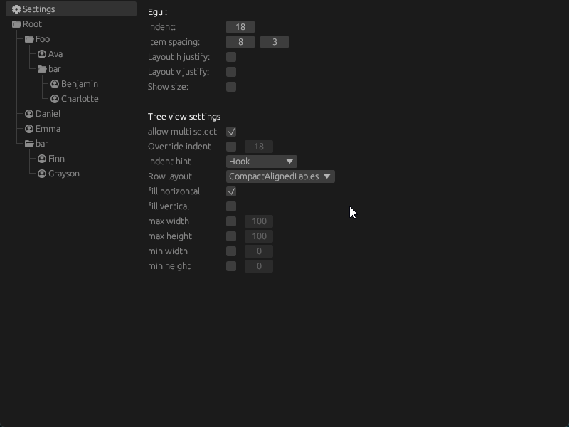

# `egui_ltreeview` is a tree view widget for [egui](https://github.com/emilk/egui)

[](https://github.com/LennysLounge/egui_ltreeview)
[](https://crates.io/crates/egui_ltreeview)
[](https://docs.rs/egui_ltreeview)
[](https://github.com/emilk/egui)

This tree view widget implements all the common features of a tree view to get you
up and running as fast as possible.

### Features:
* Directory and leaf nodes
* Node selection
* Select multiple nodes
* Keyboard navigation using arrow keys
* Frontend for Drag and Drop support
* Agnostic to the implementation of your data.

# Getting started
```
let id = ui.make_persistent_id("Names tree view");
TreeView::new(id).show(ui, |builder| {
    builder.dir(0, "Root");
    builder.leaf(1, "Ava");
    builder.leaf(2, "Benjamin");
    builder.leaf(3, "Charlotte");
    builder.close_dir();
});
```
Create a new [`TreeView`](https://docs.rs/egui_ltreeview/latest/egui_ltreeview/struct.TreeView.html) with its unique id and show it for the current ui.
Use the [`builder`](https://docs.rs/egui_ltreeview/latest/egui_ltreeview/struct.TreeViewBuilder.html) in the callback to add directories and leaves
to the tree. The nodes of the tree must have a unqiue id which implements the [`NodeId`](https://docs.rs/egui_ltreeview/latest/egui_ltreeview/trait.NodeId.html) trait.

# Examples
The examples folder contains a few examples to get you up and running quickly.
It also contains a [`playground`](https://github.com/LennysLounge/egui_ltreeview/blob/main/examples/playground/main.rs) example witch implements every feature of this widget and lets you change its settings on the fly. You can run it using `cargo run --example playground`.

# Demo


